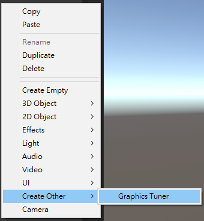
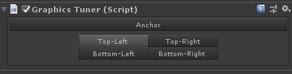
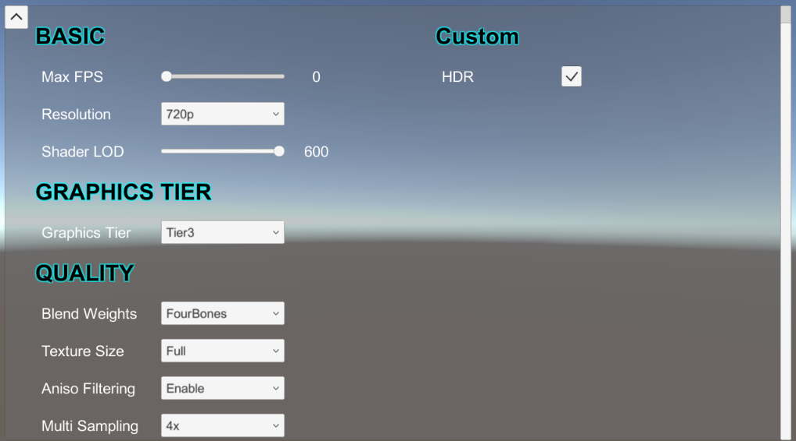
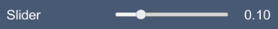

# Graphics Tuner

[中文版說明](./README_tc.md)

Quick tuning graphics settings of Unity.

## Compatibility

Only tested with below versions but may be compatible with other versions.

| Version
|------
| Unity 2018.4.x
| Unity 2020.3.x

## Usage

1. Use whole project or copy `Assets/GraphicsTuner` to your project

2. Add to Scene

    )

    

3. Play

    

## Customization

You can change the layout or add new components depend on your need.

```csharp
void Start() {
    var tuner = GraphicsTuner.Instance;
    if (tuner == null) return;

    var setting = tuner.CreateCustomSettings("Custom");
    setting.CreateToggle(
        "HDR",
        () => Camera.main.allowHDR,
        (v) => Camera.main.allowHDR = v
    );
}
```

### Module Layout

```csharp
public void SetActive(bool active);
public void SetAnchor(ComponentAnchor anchor);
```

```csharp
// Change setting of built-in modules
var tuner = GraphicsTuner.Instance;
tuner.BasicSetting.SetActive(false);
tuner.TierSetting.SetActive(false);
tuner.QualitySetting.SetAnchor(ComponentAnchor.Left);
```

### Components

+ UIConsoleSlider

    ```csharp
    UIConsoleSlider CreateSlider(string title, float[] values, Func<float> getter, Action<float> setter, Action<float> onChange = null);
    ```

    

+ UIConsoleDropdown

    ```csharp
    UIConsoleDropdown CreateDropdown(string title, string[] values, Func<int> getter, Action<int> setter, Action<int> onChange = null);
    UIConsoleDropdown CreateDropdown(string title, Type type, Func<int> getter, Action<int> setter, Action<int> onChange = null);
    ```

    

+ UIConsoleToggle

    ```csharp
    UIConsoleToggle CreateToggle(string title, Func<bool> getter, Action<bool> setter, Action<bool> onChange = null);
    ```

    

+ UIConsoleLabel

    ```csharp
    UIConsoleLabel CreateLabel(string title, out Action<string> setter);
    ```

    
